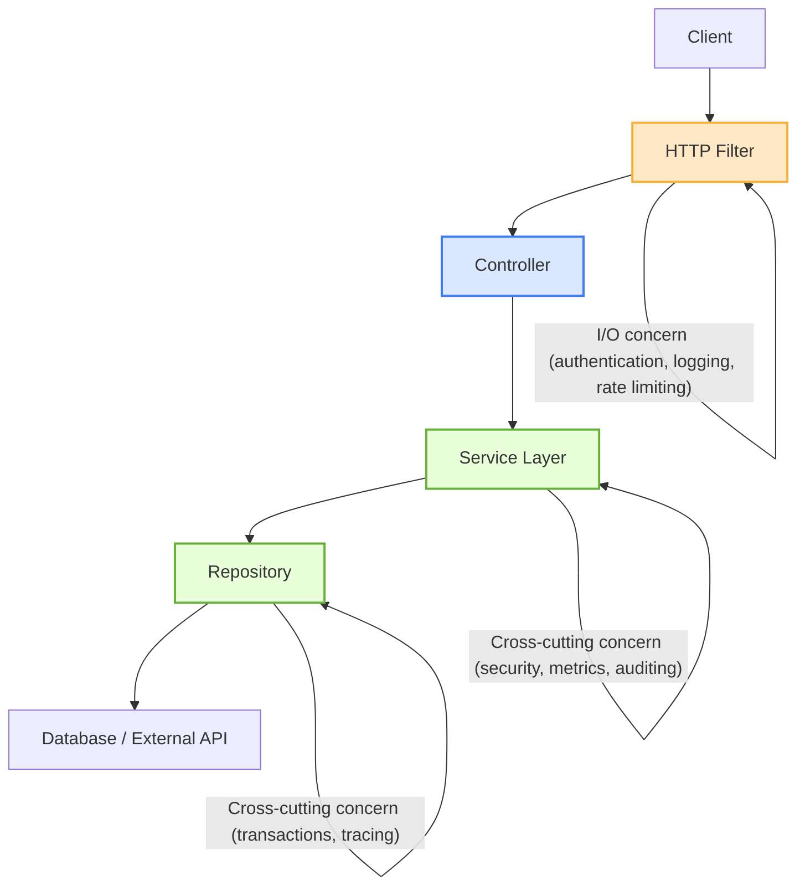

One of the biggest challenges in application development is definitely not writing code or logic, but rather deciding who that logic belongs to.

When we encounter behaviors like logging, validation, or security, we immediately face the cruel question:

> "Does this piece of code go inside my service? In my controller? Or before? Who will manage this information? Should it be public?"
> 

I guarantee you there's no right answer to any of these questions because it depends on *WHERE* in the application's *LIFECYCLE* that behavior makes sense.

For example, if we consider authentication, it can happen before entering your controller layer, or you can do this verification by implementing a service before calling your methods.

So it's clear that knowing when a behavior should execute - before, during, or after any layer of your application - is what will separate clean architecture from a big ball of mud (***Brian Foote and Joseph*** Yoder http://www.laputan.org/mud/mud.html).

That said, I wanted to define two concepts that will guide us through this article:

1. Cross-Cutting Concerns
2. I/O Concerns

## 1. Cross Cutting Concerns

Cross cutting concerns (CCCs) are behaviors that can be applied across multiple layers of an application transversally. Imagine that our application is a lasagna in layers, and each layer represents a module (data processing, persistence, visual interface, etc). According to a very experienced grandmother's recipe, you need a special tomato sauce with oregano and basil (sorry cooking experts, this is just an analogy). 


The tomato sauce in our application is the CCC and the special seasoning represents a specific functionality (a custom log format that will later integrate into a log aggregation service, for example). When we slice the lasagna, we see that the sauce, and its seasoning, is present in all layers, just as the CCC permeates a software system.

## 2. I/O Concerns

The I/O layer within an application happens before a request reaches our controller, reading or writing files for example. - what's not quite right to review.

Continuing with the lasagna analogy, this layer could be represented as an oven (the heat that cooks all layers), and the act of serving can represent the output (delivering slices to grandchildren).

## So, where do we want to get?

With the definition of these two concepts, we can now discuss where we want to get. It's common to see, especially when working with Spring boot (Java), people using the wrong tool to solve a problem. For example:

- Writing an AOP aspect to log HTTP requests when a filter would be good enough
- Implementing a servlet filter for logging a database transaction when AOP or proxies are much more recommended.

Technically both will work, but is that enough? I think that decision is with you, but what I can say is that it's important to know and answer the question: What is the responsibility of this layer where I'm implementing my functionality? Do I respect the boundaries of this layer's responsibility?

Let's get practical, imagine a scenario where we receive the following task:

> *"Dear dev, we need to measure the time of all our requests"*
> 

Well, seems very simple to implement, right? Let's stop and reflect a bit. I'll give you 5 minutes to think about it and then we'll come back to talk. Meanwhile, I'll grab a coffee.

> ☕️ Coffee time
> 

Can we come back?

If your goal is to know how long an entire HTTP request takes, including routing, controller execution and serialization, the right place would be at the I/O boundary before even reaching the controller.

In Spring boot this can be done with a *HandlerInterceptor* or even a *Filter*

```java
@Component
@Log4j
public class RequestTimingInterceptor implements HandlerInterceptor {

    @Override
    public boolean preHandle(HttpServletRequest request, HttpServletResponse response, Object handler) {
        request.setAttribute("startTime", System.currentTimeMillis());
        return true;
    }

    @Override
    public void afterCompletion(HttpServletRequest request, HttpServletResponse response,
                                Object handler, Exception ex) {
        long start = (Long) request.getAttribute("startTime");
        long duration = System.currentTimeMillis() - start;
        log.info("Request [{} {}] completed in {} ms", request.getMethod(), request.getRequestURI(), duration);
    }
}
```

And then register this interceptor in the configuration:

```java
@Configuration
public class WebConfig implements WebMvcConfigurer {
    @Override
    public void addInterceptors(InterceptorRegistry registry) {
        registry.addInterceptor(new RequestTimingInterceptor());
    }
}
```

With this, we have precise end-to-end measurements of the request lifecycle from when we enter the server until the response leaves without needing to actually enter the business logic, it works for all controllers and has great observability.

And what's the limitation of this solution? We don't have information about which method the user accessed nor the metrics of each function. But given that the implementation objective wouldn't need this type of information, it makes the implementation in this layer more attractive since I would have more complete information than an AOP for example.

But now let's consider that our objective is different:

> *"Dear dev, we need to measure how long our inventory service takes to execute a synchronization routine"*
> 

In this case, the I/O layer is irrelevant for performing measurement; we want to go inside our application where our business logic is. With Java we could use an AOP:

```java
@Aspect
@Component
@Log4j
public class ExecutionTimeAspect {
	@Around("execution(* com.example.services.syncronization..*(..))")
	public Object logExecutionTime(ProceedingJoinPoint joinPoint) throws Throwable {
				long start = System.currentTimeMillis();
        Object result = joinPoint.proceed();
        long duration = System.currentTimeMillis() - start;

        log.info("Method [{}] executed in {} ms", joinPoint.getSignature(), duration);
        return result;
	}
}
```

And what does this really measure? This AOP will measure the execution time of all methods that are within the *services.syncronization.* package.

So it's important to know the layers of your application and what their purpose is, and how far the responsibility of that layer goes. In a simplistic diagram of an MVC application, it would be important to have very strong concepts not only of functionality but also of your application's architecture:



## What can we conclude

In the end, writing code is the easy part. The real challenge is understanding the context of where the context lives.

Knowing how to choose between a Filter, an interceptor or an aspect is not just a matter of syntax and performance, it's about understanding and respecting your application's architecture.

When we know the complete lifecycle from the moment the request enters until we have the response in the client, we start making more accurate decisions.

This is the kind of technical maturity that separates functional code from code that's easy to maintain and especially test, and understanding where logic belongs is what transforms an application that simply works into one that will continue working 10 years from now.

---

> _Written by the Sapiens IT team — engineers who build before they write._

