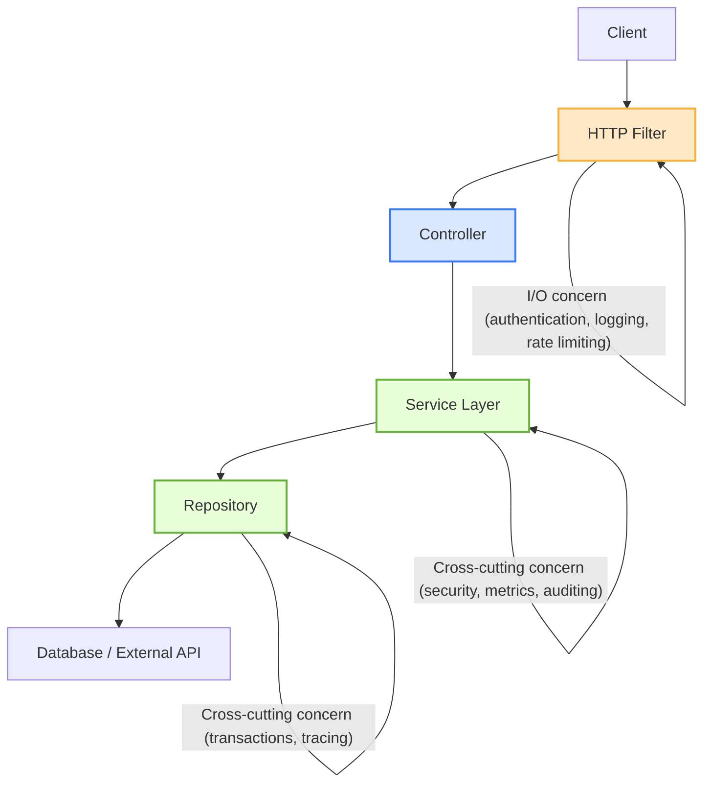

Uno de los grandes desafíos en el desarrollo de aplicaciones definitivamente no es escribir código ni lógica, sino decidir a quién pertenece esa lógica.

Cuando nos enfrentamos a comportamientos como logging, validación o seguridad, inmediatamente nos viene la cruel pregunta:

> "¿Este pedazo de código va dentro de mi service? ¿En mi controller? ¿O antes? ¿Quién va a gestionar esta información? ¿Debe ser algo público?"
> 

Te garantizo que no existe una respuesta correcta para ninguna de estas preguntas porque depende de *DÓNDE* en el *CICLO DE VIDA* de la aplicación ese comportamiento tiene sentido.

Por ejemplo, si consideramos una autenticación, puede ocurrir antes de entrar en tu capa de controller, o puedes hacer esta verificación implementando un service antes de llamar a tus métodos.

Entonces queda claro que conocer cuándo un comportamiento debe ejecutarse - antes, durante o después de cualquier capa de tu aplicación - es lo que separará una arquitectura limpia de una gran big ball of mud (***Brian Foote and Joseph*** Yoder http://www.laputan.org/mud/mud.html).

Dicho esto, quería hacer la definición de dos conceptos que nos guiarán dentro de este artículo:

1. Cross-Cutting Concerns
2. I/O Concerns

## 1. Cross Cutting Concerns

Las preocupaciones transversales (CCCs) son comportamientos que pueden aplicarse en múltiples capas de una aplicación de forma transversal. Imagina que nuestra aplicación es una lasaña en capas, y cada capa representa un módulo (procesamiento de datos, persistencia, interfaz visual, etc). Según la receta de una abuela muy experimentada, se necesita una salsa de tomate especial con orégano y albahaca (perdón expertos en cocina, esto es solo una analogía). 


La salsa de tomate dentro de nuestra aplicación es el CCC y el condimento especial representa una funcionalidad específica (un formato de log personalizado para que se integre después en un servicio de agregación de logs, por ejemplo). Al cortar la lasaña vemos que la salsa, y su condimento, está presente en todas las capas, así como el CCC impregna un sistema de software.

## 2. I/O Concerns

La capa de I/O dentro de una aplicación ocurre antes de que una solicitud llegue a nuestro controlador, lectura o escritura de archivos por ejemplo. - lo que no está muy bien revisar.

Continuando con la analogía de la lasaña, esta capa podría representarse como un horno (el calor que cocina todas las capas), y el acto de servir puede representar la salida (entregar rebanadas a los nietos).

## Entonces, ¿dónde queremos llegar?

Con la definición de estos dos conceptos, ahora podemos discurrir un poco sobre dónde queremos llegar. Es común ver, especialmente trabajando con Spring boot (Java), personas utilizando la herramienta incorrecta para resolver un problema. Por ejemplo:

- Escribir un aspecto AOP para hacer el log de solicitudes HTTP cuando un filtro sería suficiente
- Implementar un filtro servlet para un log de una transacción en la base de datos cuando un AOP o proxies son mucho más recomendados.

Técnicamente ambos funcionarán, pero ¿es eso suficiente? Creo que esa decisión es contigo, pero lo que puedo decir es que es importante conocer y responder la pregunta: ¿Cuál es la responsabilidad de esta capa donde estoy implementando mi funcionalidad? ¿Respeto los límites de la responsabilidad de esta capa?

Vamos a la práctica, imagina un escenario en el que nos llega la siguiente tarea:

> *"Querido dev, tenemos que medir el tiempo de todas nuestras solicitudes"*
> 

Bueno, parece muy simple de implementar, ¿verdad? Vamos a parar y reflexionar un poco. Te doy 5 minutos para pensar y luego volvemos a conversar. Mientras tanto, voy a tomar un café.

> ☕️ Coffee time
> 

¿Podemos volver?

Si tu objetivo es saber cuánto tiempo tarda una solicitud HTTP completa, incluyendo routing, ejecución del controlador y serialización, el lugar correcto sería en el límite de I/O antes incluso de llegar al controlador.

En Spring boot esto puede hacerse con un *HandlerInterceptor* o incluso un *Filter*

```java
@Component
@Log4j
public class RequestTimingInterceptor implements HandlerInterceptor {

    @Override
    public boolean preHandle(HttpServletRequest request, HttpServletResponse response, Object handler) {
        request.setAttribute("startTime", System.currentTimeMillis());
        return true;
    }

    @Override
    public void afterCompletion(HttpServletRequest request, HttpServletResponse response,
                                Object handler, Exception ex) {
        long start = (Long) request.getAttribute("startTime");
        long duration = System.currentTimeMillis() - start;
        log.info("Request [{} {}] completed in {} ms", request.getMethod(), request.getRequestURI(), duration);
    }
}
```

Y luego registrar este interceptor en las configuraciones:

```java
@Configuration
public class WebConfig implements WebMvcConfigurer {
    @Override
    public void addInterceptors(InterceptorRegistry registry) {
        registry.addInterceptor(new RequestTimingInterceptor());
    }
}
```

Con esto, tenemos mediciones precisas end-to-end del ciclo de vida de la solicitud desde que entramos en el servidor hasta que la respuesta sale sin necesidad de entrar de hecho en la lógica de negocio, funciona para todos los controladores y posee gran observabilidad.

¿Y cuál es la limitación de esta solución? No poseemos información de qué método accedió el usuario ni las métricas de cada función. Pero dado que el objetivo de la implementación no necesitaría este tipo de información, hace más atractiva la implementación en esta capa ya que tendría información más completa que un AOP por ejemplo.

Pero ahora vamos a considerar que nuestro objetivo sea diferente:

> *"Querido dev, necesitamos medir cuánto tiempo tarda nuestro servicio de inventario en ejecutar una rutina de sincronización"*
> 

En este caso, la capa de I/O es irrelevante para realizar medición; queremos ir dentro de nuestra aplicación donde está nuestra lógica de negocio. Con Java podríamos usar un AOP:

```java
@Aspect
@Component
@Log4j
public class ExecutionTimeAspect {
	@Around("execution(* com.example.services.syncronization..*(..))")
	public Object logExecutionTime(ProceedingJoinPoint joinPoint) throws Throwable {
				long start = System.currentTimeMillis();
        Object result = joinPoint.proceed();
        long duration = System.currentTimeMillis() - start;

        log.info("Method [{}] executed in {} ms", joinPoint.getSignature(), duration);
        return result;
	}
}
```

¿Y qué mide esto realmente? Este AOP medirá el tiempo de ejecución de todos los métodos que están dentro del paquete de *services.syncronization.* 

Entonces es importante conocer las capas de tu aplicación y cuál es el propósito de ellas, y hasta dónde va la responsabilidad de esa capa. En un diagrama simplista de una aplicación MVC sería importante tener muy fuertes los conceptos no solo de la funcionalidad sino también de la arquitectura de tu aplicación:



## ¿Qué podemos concluir?

Al final de cuentas, escribir código es la parte fácil. El verdadero desafío es entender el contexto de dónde vive el contexto.

Saber elegir entre un Filter, un interceptor o un aspect no es solo cuestión de sintaxis y rendimiento, es sobre entender y respetar la arquitectura de tu aplicación.

Cuando conocemos el ciclo de vida completo desde el momento en que la solicitud entra hasta que tenemos la respuesta en el cliente, pasamos a tomar decisiones más acertadas.

Este es el tipo de madurez técnica que separa un código funcional de un código fácil de mantener y principalmente probar, y entender dónde pertenece la lógica es lo que transforma una aplicación que simplemente funciona de una que va a continuar funcionando dentro de 10 años.

---

> _Escrito por el equipo Sapiens IT — ingenieros que construyen antes de escribir._

