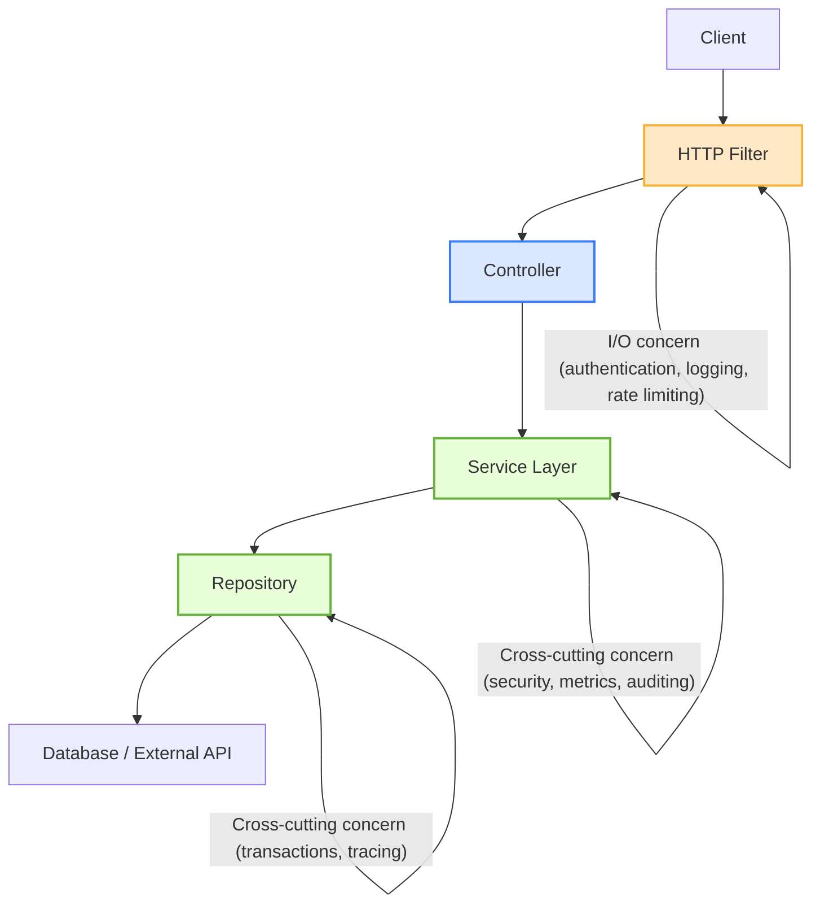

Uma dos desafios grandes desafios no desenvolvimento de aplicações definitivamente não é escrever código muito menos lógica, mas sim decidir a quem essa lógica pertence.

Quando nos deparamos com comportamentos como logging, validação ou segurança nos vem logo a cruel pergunta:

> “Esse pedaço de código vai dentro da minha service? no meu controller? Ou antes? Quem vai gerir essa informação? Deve ser algo público?”
> 

Te garanto que não existe uma resposta certa para nenhuma dessas perguntas porque depende de *ONDE* no *LIFECYCLE* da aplicação aquele comportamento faz sentido.

Por exemplo, se considerarmos uma autenticação ela pode acontecer antes de entrar na sua camada de controller, ou você pode fazer essa verificação implementando uma service antes de chamar seus métodos.

Então fica claro que conhecer quando um comportamento deve executar - antes, durante, ou depois de uma camada qualquer de sua aplicação é o que vai separar uma arquitetura limpa de uma grande big ball of mud (***Brian Foote and Joseph*** Yoder http://www.laputan.org/mud/mud.html).

Dito isto, queria fazer a definição de dois conceitos que vão nos guiar dentro desse artigo:

1. Cross-Cutting Concerns
2. I/O Concerns

## 1. Cross Cutting Concerns

Cross cutting concerns (CCCs) são comportamentos que podem ser aplicados em múltiplas camadas de uma aplicação de forma transversal. Imagine que nossa aplicação é uma lasanha em camadas, e cada camada representa um módulo (processamento de dados, persistência, interface visual, etc). Segundo a receita de uma vovó muito experiente, é preciso um molho de tomates especial com orégano e manjericão (desculpa especialistas em cozinha, isto é apenas uma analogia). 


O molho de tomate dentro da nossa aplicação é o CCC e o tempero especial representa uma funcionalidade específica (um formato de log personalizado para que integre depois em um serviço de agregados de logs, por exemplo). Ao fatiar a lasanha vemos que o molho, e seu tempero, está presente em todas as camadas e assim como o CCC permeia um sistema de software.

## 2. I/O Concerns

A camada de IO dentro de uma aplicação acontece antes de um request chegar dentro do nosso controller, leitura ou escrita de arquivos por exemplo. - o que nao muito certo rever.

Continuando com a analogia da lasanha, essa camada poderia ser representada como um forno (o calor que cozinha todas as camadas), e o ato de servir pode representar a saída (entregar fatias aos netos).

## Então, mas onde queremos chegar?

Com a definição destes dois conceitos, agora podemos discorrer um pouco sobre onde queremos chegar. É comum ver, especialmente trabalhando com Spring boot (Java), pessoas utilizando a ferramenta errada para o resolver u problema. Por exemplo:

- Escrever um AOP aspect para fazer o log de HTTP requests quando um filter seria bom o suficiente
- Implementar um servlet filter para um log de uma transação no banco de dados quando um AOP ou proxies são muito mais recomendados.

Tecnicamente os dois irão funcionar, mas isso é o suficiente? Acho que essa decisão é contigo, mas o que eu posso dizer é que é importante conhecer e responder a pergunta: Qual a responsabilidade dessa camada que eu estou implementando minha funcionalidade? Eu respeito os limites da responsabilidade dessa camada?

Vamos para a prática, imagine cenário em que nos chega a seguinte task:

> *“Caro dev, temos que medir o tempo que todos os nossos requests”*
> 

Bom, parece muito simples de implementar né? Vamos parar e refletir um pouco sobre. Te dou 5 minutos pra pensar sobre e depois voltamos a conversar. Enquanto isso eu vou pegar um café.

> ☕️ Coffee time
> 

 Podemos voltar certo?

Se o seu objetivo for saber quanto tempo um request inteiro de HTTP request leva, incluindo routing, controller execution e serializaçao o lugar certo seria no I/O boundary antes mesmo de chegar ao controller

Em Spring boot isso pode ser feito com um *HandlerInterceptor* ou até mesmo um *Filter*

```java
@Component
@Log4j
public class RequestTimingInterceptor implements HandlerInterceptor {

    @Override
    public boolean preHandle(HttpServletRequest request, HttpServletResponse response, Object handler) {
        request.setAttribute("startTime", System.currentTimeMillis());
        return true;
    }

    @Override
    public void afterCompletion(HttpServletRequest request, HttpServletResponse response,
                                Object handler, Exception ex) {
        long start = (Long) request.getAttribute("startTime");
        long duration = System.currentTimeMillis() - start;
        log.info("Request [{} {}] completed in {} ms", request.getMethod(), request.getRequestURI(), duration);
    }
}
```

E depois registrar esse interceptor nas configurações:

```java
@Configuration
public class WebConfig implements WebMvcConfigurer {
    @Override
    public void addInterceptors(InterceptorRegistry registry) {
        registry.addInterceptor(new RequestTimingInterceptor());
    }
}
```

Com isso, temos medidas precisas end-to-end do lifecycle do request desde quando entramos no server até a resposta sair sem precisar entrar de fato no business logic, funciona para todos os controllers e possui ótima observabilidade.

E qual a limitação desta solução? não possuímos informação de qual método o usuário acessou nem as métricas de cada função. Mas dado que o objetivo da implementação não precisaria desse tipo de informação torna mais atrativo a implementação nesta camada já que eu teria informação mais completa que um AOP por exemplo.

Mas agora vamos considerar que nosso objetivo seja diferente:

> *“Caro dev, precisamos medir quanto tempo o nosso serviço de inventário demora para executar uma rotina de sincronização ”*
> 

Neste caso, a camada de I/O é irrelevante para realizar medição; queremos ir dentro da nossa aplicação onde o nosso business logic está. Com o java poderíamos usar um AOP:

```java
@Aspect
@Component
@Log4j
public class ExecutionTimeAspect {
	@Around("execution(* com.example.services.syncronization..*(..))")
	public Object logExecutionTime(ProceedingJoinPoint joinPoint) throws Throwable {
				long start = System.currentTimeMillis();
        Object result = joinPoint.proceed();
        long duration = System.currentTimeMillis() - start;

        log.info("Method [{}] executed in {} ms", joinPoint.getSignature(), duration);
        return result;
	}
}
```

E o que isso realmente mede? Esse AOP vai medir o tempo de execução de todos os métodos que estão dentro do pacote de *services.syncronization.* 

Então é importante conhecer as camadas da sua aplicação e qual o propósito dela, e até onde vai a responsabilidade dessa sua camada. Em um diagrama simplista de uma aplicação MVC seria importante ter muito forte os conceitos não só da funcionalidade mas também da arquitetura da sua aplicação:



## O que podemos concluir

No fim das contas, escrever código é a parte fácil. O verdadeiro desafio é entender o contexto de onde o contexto vive.

Saber escolher entre um Filter, um interceptor ou um aspect não é só questão de sintaxe e performance, é sobre entender e respeitar a arquitetura da sua aplicação.

Quando conhecemos o lifecycle completo desde o momento em que o request entra até que temos a resposta no cliente passamos a tomar decisões mais acertivas.

Esse é o tipo de maturidade técnica que separa um código funcional de um código fácil de manter e principalmente testar e entender onde a lógica pertence é que transforma uma aplicação que simplesmente funciona de uma que vai ta continuar funcionando daqui a 10 anos.

---

> _Escrito pela equipe Sapiens IT — engenheiros que constroem antes de escrever._

